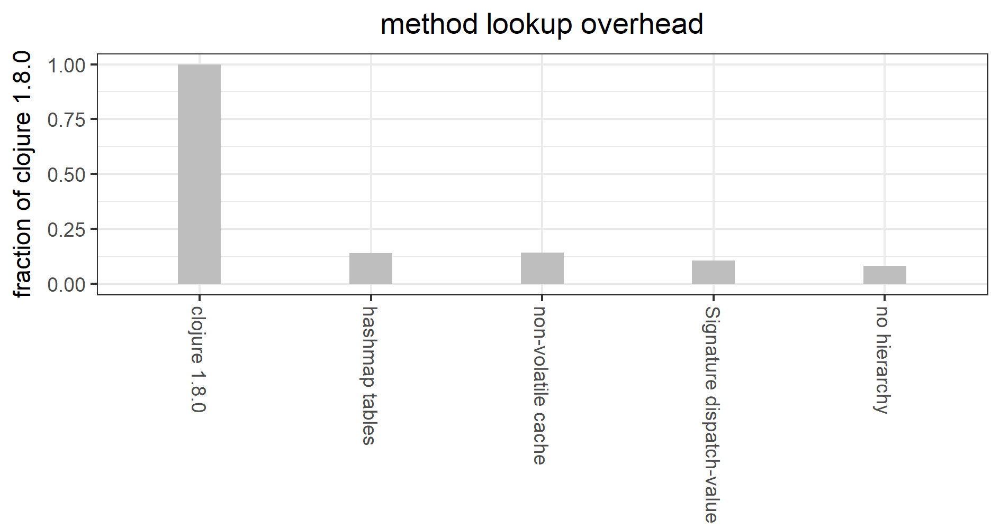

# faster-multimethods

Backwards compatible alternative to the 
Clojure 1.8.0 implementation of generic functions (aka multimethods)
via  `defmulti`/`defmethod`/`MultiFn`.
Roughly 1/10 the cost for method lookup
(see [multimethod-experiments]() for benchmark details).


## Changes from Clojure 1.8.0



The main differences from the Clojure 1.8.0 implementation:

1. In
[`MultiFn`](https://github.com/clojure/clojure/blob/master/src/jvm/clojure/lang/MultiFn.java),
replace 
[`PersistentHashMap`](https://github.com/clojure/clojure/blob/master/src/jvm/clojure/lang/PersistentHashMap.java)
with 
[`java.util.HashMap`](https://docs.oracle.com/javase/8/docs/api/java/util/HashMap.html),
for the `methodTable` (maps dispatch values to a defined methods),
`preferTable` (resolves multiple applicable defined methods),
and `methodCache` (maps an actual dispatch value 
to the resolved applicable method).

    Method lookup overhead, relative to a hand-written Java 
    if-then-else, is about 14% of Clojure 1.8.0. This is for a
    benchmark testing for intersection of numerical sets, 1 of 9 
    methods called at random. See 
    [multimethod-experiments](https://github.com/palisades-lakes/multimethod-experiments) for 
    more details

    The HashMaps here are treated as immutable, so their behavior
is functionally equivalent. 
However, this requires a fair amount of discipline from all
future developer, so is perhaps not the best choice.
Experiments with immutable
maps from [Guava](https://github.com/google/guava) showed 
essentially the same level of performance, but I prefer not to add
such a large dependency to this tiny bit of code.
I could include a minimal immutable map implementation, but that 
would be duplicating work better done elsewhere.

    The fact that HashMaps perform so much better that PersistentHashMaps,
in this context, suggests that there might be opportunities for
improving the performance of Clojure collections more generally.
Supporting evidence can be seen in
[clj-tuple](https://github.com/ztellman/clj-tuple)
and 
[cambrian-collections](https://github.com/ztellman/cambrian-collections).
See also:
[Z. Tellman, Using Clojure To Generate Java To Reimplement Clojure](https://www.factual.com/blog/using-clojure-to-generate-java-to-reimplement-clojure). 
It is possible that performance improvements to the
Clojure collections would make this little library unnecessary.

2. Make the `methodCache` non-volatile. 

    Method lookup overhead for this benchmark is also about 14% 
    of Clojure 1.8.0.
    
    This change may cause redundant cache updates, but I believe that's
    sufficiently low probability to not affect any performance gain, 
    and, in any case, the cache should converge quickly to a stable state.
    
    If my reasoning about this is wrong, I'd like to know.
    Since it doesn't actually improve this particular benchmark
    I may revert anyway.
    
3. Support more efficient dispatch values.  

    I've chosen to add support for an additional special case of
    dispatch values,
    which I call Signatures --- essentially short lists of Classes.
    
    Method lookup overhead is then about 11% of Clojure 1.8.0.
    
    This is backwards compatible; and can be adopted by changing
    the dispatch function from, eg, `[(class a) (class b)]` to
    `(signature a b)`.
    
    The Clojure documentation is not very clear about what are
    and aren't legal dispatch values. Examining the source
    (in particular, 
    [clojure.core/isa?](https://github.com/clojure/clojure/blob/master/src/clj/clojure/core.clj#L5468)) 
    shows that legal dispatch values are Classes, and instances
    of `clojure.lang.Named` (ie Symbols and Keywords),
    and, recursively, IPersistentVectors containing legal dispatch
    values.
    
    As in (1), we could permit any List of dispatch values as a 
    dispatch value. However, because dispatch values are used
    as keys in Maps, permitting mutable Lists would be expecting
    a high degree of discipline,
    not only from this library's developers, but from its' users
    as well.
    
    As above, I could implement more efficient immutable lists
    internally, or import them from some external dependency,
    but, as above, that's likely better left to more general
    improvement of Clojure collections.
    
    What I've chosen to do here is add support for what I believe
    is an important special case: short immutable lists of Classes:
    no Symbols or Keywords, no arbitrary 'hierarchy', and no recursion.
    
4. Permit a `:hierarchy false` option.

    Method lookup overhead is then about 8% of Clojure 1.8.0.
    
    Every multimethod (instance of MultiFn) contains a reference
    to a (unfortunately named) `hierarchy`, which provides
    a partial ordering of dispatch values thru a directed acyclic
    graph whose nodes are atomic dispatch values (Named,
    and Classes). The graph includes implied edges 
    from the `isAssignableFrom` Class graph as well as explicit
    edges added using `derive`.
    
    Because the hierarchy can modified at any time, each MultiFn
    has a reference to a shared mutable object, whose state must
    be checked for changes every time a multimethod is called.
    
    However, an important special case is one where only Classes
    are used as atomic dispatch values. In this case, the hierarchy
    is irrelevant. 
    
    Removing the need for synchronizing with the `hierarchy`,
    reduces the overhead by 3 percentage points 
    (relative to Clojure 1.8.0) and by about 25 percent relative 
    to stage 3.
    
    
## Usage

Fastest:

```
(require `[faster.multimethods.core :as fmc])

(fmc/defmulti intersects?
  "Test for general set intersection."
  
  {}  
  
  (fn intersects?-dispatch [s0 s1] (fmc/extract-signature s0 s1))
  
  :hierarchy false)
  
(fmc/defmethod intersects? 
  (fmc/signature IntegerInterval java.util.Set)
  [^IntegerInterval s0 ^java.util.Set s1]
  (.intersects s0 s1))
  
 ...
 ``` 
  
Most general:

```
(require `[faster.multimethods.core :as fmc])

(fmc/defmulti intersects?
  "Test for general set intersection."
  
  {}  
  
  (fn intersects?-dispatch [s0 s1] [(class s0) (class s1))))
  
(fmc/defmethod intersects? 
  [IntegerInterval java.util.Set]
  [^IntegerInterval s0 ^java.util.Set s1]
  (some #(.contains s0 %) s1))
  
 ...
 ``` 
  
## Acknowledgements

### 

YourKit is kindly supporting open source projects with its full-featured Java
Profiler.

YourKit, LLC is the creator of innovative and intelligent tools for profiling
Java and .NET applications. Take a look at YourKit's leading software products:

* <a href="http://www.yourkit.com/java/profiler/index.jsp">YourKit Java Profiler</a> and
* <a href="http://www.yourkit.com/.net/profiler/index.jsp">YourKit .NET Profiler</a>.


