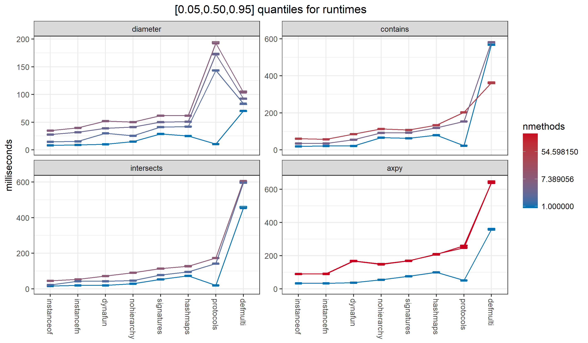
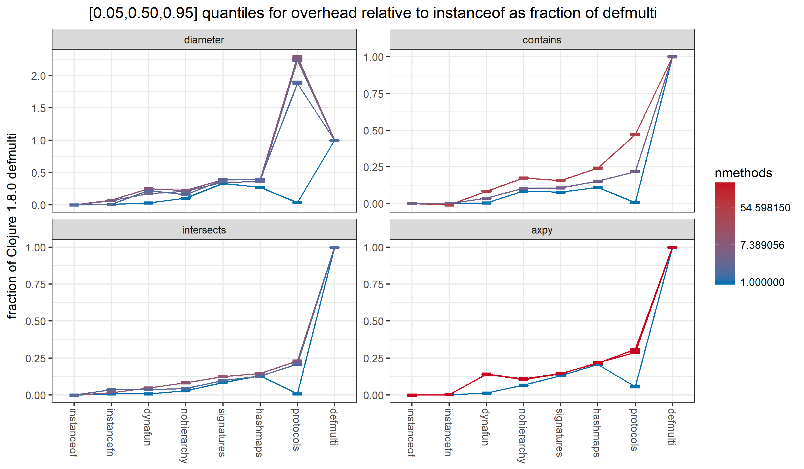

# faster-multimethods 

[](https://clojars.org/palisades-lakes/faster-multimethods)

Alternative to the 
Clojure 1.8.0 implementation of generic functions (aka multimethods)
via  `defmulti`/`defmethod`/`MultiFn`.

Very roughly 1/10 the cost for method lookup of Clojure 1.8.0,
and comparable in performance to using protocols, while being
fully dynamic.
See 
[multimethod-experiments](https://github.com/palisades-lakes/multimethod-experiments)
for benchmark details.

Runtimes for various dynamic method lookup algorithms. 
`hashmaps`, `signatures`, and `nohierarchy` are available from
`faster-multimethods`.



Overhead, taking a hand optimized Java if-then-else `instanceof`
algorithm as the baseline, as a fraction of the overhead of
Clojure 1.8.0 `defmulti`:



## Changes from Clojure 1.8.0

### Performance improvements

1. In
[`MultiFn`](https://github.com/clojure/clojure/blob/master/src/jvm/clojure/lang/MultiFn.java),
replace 
[`PersistentHashMap`](https://github.com/clojure/clojure/blob/master/src/jvm/clojure/lang/PersistentHashMap.java)
with 
[`java.util.HashMap`](https://docs.oracle.com/javase/8/docs/api/java/util/HashMap.html)
(`hashmaps` in the plots).

    The HashMaps here are treated as immutable, so their behavior
is functionally equivalent. 
However, this requires a fair amount of discipline from all
future developer, so is perhaps not the best choice.
Experiments with immutable
maps from [Guava](https://github.com/google/guava) showed 
essentially the same level of performance, but I prefer not to add
such a large dependency to this tiny bit of code.
I could include a minimal immutable map implementation, but that 
would be duplicating work better done elsewhere.

    The fact that HashMaps perform so much better that PersistentHashMaps,
in this context, suggests that there might be opportunities for
improving the performance of Clojure collections more generally.
Supporting evidence can be seen in
[clj-tuple](https://github.com/ztellman/clj-tuple)
and 
[cambrian-collections](https://github.com/ztellman/cambrian-collections).
See also:
[Z. Tellman, Using Clojure To Generate Java To Reimplement Clojure](https://www.factual.com/blog/using-clojure-to-generate-java-to-reimplement-clojure). 
It is possible that performance improvements to the
Clojure collections would make this little library unnecessary.

2. Permit more efficient dispatch values (`signatures` in the plots).

    I've chosen to add support for an additional special case of
    dispatch values,
    which I call Signatures --- essentially short lists of Classes.
    
    This is backwards compatible; and can be adopted by changing
    the dispatch function from, eg, `[(class a) (class b)]` to
    `(signature a b)`.
    
3. Permit a `:hierarchy false` option to `defmulti`
(`nohierarchy` in the plots).

    Every multimethod (instance of MultiFn) contains a reference
    to a `Var` holding a `hierarchy`. This shared mutable state must
    be checked for changes every time a multimethod is called.
    
    An important special case is one where only classes,
    and sequences of classes
    are used as dispatch values. In this case, the hierarchy
    is irrelevant. 
    
    Removing the need for synchronizing with the `hierarchy`,
    further reduces the overhead.
    
### Semantic changes

The current implementation is not quite backwards compatible with 
Clojure 1.8.0, because it fixes 4 issues with how the preferred
method is found.

The first issue is pretty clearly a bug:

1. [MultiFn.prefers()](https://github.com/clojure/clojure/blob/clojure-1.8.0/src/jvm/clojure/lang/MultiFn.java#L105)
ignores the multimethod's internal hierarchy.
This is discussed in 
[CLJ-2234](https://dev.clojure.org/jira/browse/CLJ-2234),
which has a patch submitted.
The problem is that ```prefers``` calls ```parents```
without passing a hierarchy, so it is evaluated relative to the
global hierarchy, rather than the multimethod's.

faster-multimethods contains unit tests demonstrating the
problem in Clojure 1.8.0 and verifying the fix.

I plan to raise issues for the 3 remaining, more debatable problems
once this one is resolved.

2. [findAndCacheBestMethod](https://github.com/clojure/clojure/blob/clojure-1.8.0/src/jvm/clojure/lang/MultiFn.java#L161)
doesn't correctly find the minima of the 
[dominates](https://github.com/clojure/clojure/blob/clojure-1.8.0/src/jvm/clojure/lang/MultiFn.java#L126)
partial ordering.
It does a simple reduction of the ```methodTable```, 
maintaining a single ```bestEntry```.
If it encounters an entry that is not strictly ordered, 
in either direction,
relative to the ```bestEntry```, then it throws an exception.
However, it's possible for there to be a later entry which
would dominate both.
What the reduction should do is maintain a set of current minima.
If the current entry dominates any elements of the set, then those 
should be removed.
If the current entry is not dominated by any element of the set,
then it should be added.

I haven't created a unit test for this issue yet, because I'm not sure 
how to reliably cause a spurious exception to be thrown.

The remaining 2 problems could be attributed to differing expectations
for the transitivity of the ```dominates``` relation.

My expectation is that ```dominates``` should be transitive, that is:
```dominates(x,y)``` and ```dominates(y,z)``` should imply
```dominates(x,z)```.

The ```dominates``` relation is implemented as 
[isA](https://github.com/clojure/clojure/blob/clojure-1.8.0/src/jvm/clojure/lang/MultiFn.java#L122)
extended with
[prefers](https://github.com/clojure/clojure/blob/clojure-1.8.0/src/jvm/clojure/lang/MultiFn.java#L105).
```isA```, which combines Java inheritance with a Clojure hierarchy,
is transitive.
```prefers``` is not.

The documentation for 
[prefer-method](https://clojure.github.io/clojure/clojure.core-api.html#clojure.core/prefer-method)
only specifies that ```(prefer-method f x y)``` results in methods
defined for ```f``` for dispatch value ```x``` will be preferred
to methods for ```y```.
One could read this as meaning there is no implied transitivity,
so that the only pairs in the ```prefers``` relation are those
explicitly defined via ```prefer-method```.
However, the code doesn't do that either.

```Java
private boolean prefers(Object x, Object y) {
  IPersistentSet xprefs = (IPersistentSet) getPreferTable().valAt(x);
  if(xprefs != null && xprefs.contains(y))
    return true;
  for(ISeq ps = RT.seq(parents.invoke(y)); ps != null; ps = ps.next())
    {
    if(prefers(x, ps.first()))
      return true;
    }
  for(ISeq ps = RT.seq(parents.invoke(x)); ps != null; ps = ps.next())
    {
    if(prefers(ps.first(), y))
      return true;
    }
  return false;
}
```

```prefers``` first checks to see if there is an explicit edge on the
prefer-method graph for ```(x,y)```. If so, return true.
Fine so far.

3. The second step in ```prefers``` essentially iterates over the
```isA``` ancestors of ```y```, returning true if ```x``` 
is preferred to any ancestor of ```y```. 
This implies that ```(prefer-method f x Object)``` will cause the
method for ```x``` to be preferred to a method defined for any other
Java class or interface ```y```, as long as we don't have ```isA(x,y)```.
The fix for this is to just remove the first ```for``` loop from 
```prefers```. faster-multimethods contains a unit test demonstrating
the behavior of Clojure 1.8.0 and verifying the fix.

The 3rd step in ```prefers``` checks to see if any ```isA```
ancestor of ```x``` is preferred to ```y```. In this way, ```prefers```
inherits the transitivity of ```isA```. This is correct.

4. ```prefers``` is missing the search needed to be completely transitive.
It needs to check all the keys ```k``` of the ```preferTable```,
returning true if ```prefers(x,k)``` and ```prefers(k,y)```.
faster-multimethod contains a unit test demonstrating
the non-transitivity of Clojure 1.8.0, and verifying the transitivity
of its own implementation
. 
## Usage

### Dependency 

Maven:

```xml
<dependency>
  <groupId>palisades-lakes</groupId>
  <artifactId>faster-multimethods</artifactId>
  <version>0.0.3</version>
</dependency>
```

Leinigen/Boot:
```clojure
Leiningen/Boot
[palisades-lakes/faster-multimethods "0.0.3"]
```

### Code examples

Fastest:

```
(require `[palisades.lakes.multimethods.core :as fmc])

(fmc/defmulti intersects?
  "Test for general set intersection."
  
  {}  
  
  (fn intersects?-dispatch [s0 s1] (fmc/extract-signature s0 s1))
  
  :hierarchy false)
  
(fmc/defmethod intersects? 
  (fmc/signature IntegerInterval java.util.Set)
  [^IntegerInterval s0 ^java.util.Set s1]
  (.intersects s0 s1))
  
 ...
 ``` 
  
Most general:

```
(require `[palisades.lakes.multimethods.core :as fmc])

(fmc/defmulti intersects?
  "Test for general set intersection."
  
  {}  
  
  (fn intersects?-dispatch [s0 s1] [(class s0) (class s1))))
  
(fmc/defmethod intersects? 
  [IntegerInterval java.util.Set]
  [^IntegerInterval s0 ^java.util.Set s1]
  (some #(.contains s0 %) s1))
  
 ...
 ``` 
  
## Acknowledgments

### 

YourKit is kindly supporting open source projects with its full-featured Java
Profiler.

YourKit, LLC is the creator of innovative and intelligent tools for profiling
Java and .NET applications. Take a look at YourKit's leading software products:

* <a href="http://www.yourkit.com/java/profiler/index.jsp">YourKit Java Profiler</a> and
* <a href="http://www.yourkit.com/.net/profiler/index.jsp">YourKit .NET Profiler</a>.


